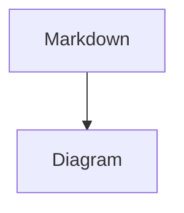

# @dpklabs/minueditor

Controlled React markdown editor built on CodeMirror 6.

## Install

```bash
npm install @dpklabs/minueditor
```

MinuEditor uses CodeMirror as peer dependencies so host-provided CodeMirror extensions, such as fenced-code language support, share the same CodeMirror runtime as the editor. If your package manager does not install peers automatically, install the listed `@codemirror/*` peer packages alongside MinuEditor.

Install directly from a GitHub release tag:

```bash
npm install github:spdydve/minueditor#v0.1.0
```

Import the default styles:

```ts
import '@dpklabs/minueditor/theme.css'
```

## Basic usage

```tsx
import { MarkdownEditor } from '@dpklabs/minueditor'

function Example() {
  const [value, setValue] = useState('# Hello')

  return <MarkdownEditor value={value} onChange={setValue} />
}
```

## Viewing vs editing

`MarkdownEditor` is editing-only. If you want an app-level display mode, compose it with `MarkdownRenderer`.

```tsx
import { MarkdownEditor, MarkdownRenderer } from '@dpklabs/minueditor'

function EditableNote() {
  const [editing, setEditing] = useState(false)
  const [value, setValue] = useState('Hello **world**')

  if (!editing) {
    return <MarkdownRenderer value={value} onClick={() => setEditing(true)} />
  }

  return <MarkdownEditor value={value} onChange={setValue} autoFocus />
}
```

## Behavior

`MarkdownEditor` always ships the full editing surface.

Built-in behavior toggles are intentionally small:

1. editable by default
2. `readOnly` when you want a non-editable editor surface

```tsx
function ReadOnlyExample() {
  return (
    <MarkdownEditor
      value={'# Locked\n\nThis surface is visible but not editable.'}
      onChange={() => {}}
      readOnly
    />
  )
}
```

## Initial render and focus

`MarkdownEditor` is editable by default, but it does **not** focus itself unless you pass `autoFocus`.

That means this opens as an editable editor surface without showing a cursor:

```tsx
<MarkdownEditor value={value} onChange={setValue} />
```

On initial mount, when the editor is not focused, markdown syntax is treated as inactive and rendered visually. For example:

```md
# Heading
```

is displayed like a heading instead of showing the raw `# Heading` text.

When the user clicks into the editor, the focused/active line reveals the markdown markers needed for editing. If you want the editor to place the cursor immediately and reveal markers on the first active line, pass `autoFocus`:

```tsx
<MarkdownEditor value={value} onChange={setValue} autoFocus />
```

Use `readOnly` only when the surface should not be editable. For a fully static display mode, use `MarkdownRenderer` instead.

## Styling guidance

Prefer MinuEditor CSS variables for app-level theming instead of styling CodeMirror internals directly:

```css
.my-editor {
  --me-text: #cdd6f4;
  --me-heading-color: #cdd6f4;
  --me-font-family: ui-monospace, SFMono-Regular, Menlo, Monaco, Consolas, monospace;
  --me-content-padding: 12px 0 0;
}
```

Avoid broad selectors that target generated editor internals, especially with `!important`, such as:

```css
.cm-line[class*="heading"] { ... }
.me-h1 { color: ... !important; }
```

MinuEditor uses internal marker spans like `.me-token` to hide inactive markdown syntax while preserving cursor/layout behavior. Styling through variables keeps heading colors, text colors, and token hiding working together.

## Editor modes

`MarkdownEditor` supports two editing modes:

```tsx
<MarkdownEditor value={value} onChange={setValue} mode="live" />
<MarkdownEditor value={value} onChange={setValue} mode="source" />
```

`live` is the default. It provides Obsidian/Notion-style live preview editing: inactive markdown renders visually, widgets render for images/tables/code blocks, and active lines reveal source markdown as needed.

`source` shows raw markdown everywhere. It disables live widgets and token hiding, so images, tables, code fences, and formatting markers remain visible as plain markdown while editing.

Use `MarkdownRenderer` separately for a fully rendered reading view, such as hosted pages, published notes, previews, or exports.

## Editor command API

Use a ref when your app needs to drive the editor from an external toolbar, modal, or command palette. MinuEditor exposes common commands while still keeping the underlying CodeMirror `view` available for advanced integrations.

```tsx
import { useRef } from 'react'
import { MarkdownEditor, type MarkdownEditorHandle } from '@dpklabs/minueditor'

function NoteEditor() {
  const editorRef = useRef<MarkdownEditorHandle>(null)

  return (
    <>
      <button onClick={() => editorRef.current?.undo()}>Undo</button>
      <button onClick={() => editorRef.current?.redo()}>Redo</button>
      <button onClick={() => editorRef.current?.toggleBold()}>Bold</button>
      <button onClick={() => editorRef.current?.openImagePicker()}>Image</button>

      <MarkdownEditor ref={editorRef} value={value} onChange={setValue} />
    </>
  )
}
```

Available handle methods include:

- `focus()` / `blur()`
- `undo()` / `redo()`
- `getMarkdown()`
- `getSelection()` / `setSelection(from, to?)`
- `getHeadings()` / `goToHeading(slug)`
- `insertMarkdown(markdown)`
- `replaceSelection(markdown)`
- `insertImage({ src, alt })`
- `openImagePicker()`
- `toggleBold()` / `toggleItalic()` / `toggleInlineCode()` / `wrapLink()`
- `insertTable()` / `insertCodeBlock()`

For custom integrations, the handle also exposes `view`, the underlying CodeMirror `EditorView`:

```tsx
editorRef.current?.view?.dispatch(...)
```

Prefer the named commands for common editor actions; use `view` when you need lower-level CodeMirror behavior.

## GitHub-style alerts and callouts

MinuEditor recognizes the five portable GitHub alert types in live and static rendering:

```md
> [!NOTE]
> Useful context for the reader.

> [!WARNING]
> Something requires extra care.
```

Supported types are `NOTE`, `TIP`, `IMPORTANT`, `WARNING`, and `CAUTION`. The default slash-command menu includes one command for each type. Live mode displays a labeled callout and reveals the exact marker while it is being edited; source mode always shows the ordinary blockquote Markdown. Unknown or malformed markers remain normal blockquotes.

Callouts are document content and travel with Markdown exports. They are separate from host-owned comments or `DocumentAnnotation` review metadata.

## Mermaid diagrams

Mermaid fenced blocks are opt-in and render in both `MarkdownEditor` and `MarkdownRenderer`:

````md

````

```tsx
<MarkdownEditor value={value} onChange={setValue} mermaid />
<MarkdownRenderer value={value} mermaid />
```

Mermaid is loaded lazily only when enabled. Rendering always uses Mermaid's strict security mode. In live mode, an inactive fence becomes a diagram; **Edit source** reveals the exact fenced Markdown. Source mode always shows Markdown. Invalid diagrams show a readable error and source fallback instead of losing content.

A config object can select a Mermaid theme or provide a host-controlled lazy engine loader:

```tsx
<MarkdownEditor
  value={value}
  onChange={setValue}
  mermaid={{ theme: 'dark' }}
/>
```

When Mermaid is disabled, `mermaid` fences remain ordinary editable and statically rendered code blocks. The initial async lifecycle is intentionally internal and derived from callouts plus Mermaid; future math or preview blocks can reuse it after proving matching loading, cancellation, error, accessibility, and fallback needs.

## Comments and change highlights

Line-anchored `DocumentAnnotation` decorations use the same tinted-surface visual language as callouts, with a right-side accent rail to distinguish review metadata from authored callout content. Comment, generated, added, updated, and deleted kinds have separate semantic colors. Range annotations remain compact inline highlights so they do not turn partial text selections into block surfaces.

The host continues to own comment threads, actors, selection state, and side panels. Theme variables such as `--me-comment-accent`, `--me-comment-bg`, `--me-generated-accent`, and `--me-generated-bg` can override the defaults.

## Heading outlines and anchors

MinuEditor exposes syntax-tree-backed heading data while leaving outline panels and note URL construction to the host application:

```tsx
import { parseMarkdownHeadings } from '@dpklabs/minueditor'

const headings = parseMarkdownHeadings(markdown)
// [{ level, text, from, to, contentFrom, contentTo, slug }]

editorRef.current?.goToHeading(headings[0].slug)
```

`slug` values are deterministic within the document. Duplicate headings receive `-1`, `-2`, and subsequent suffixes. Unicode letters are preserved, punctuation is removed, whitespace becomes `-`, and an empty result falls back to `section`.

Use `getMarkdownHeadings(editorState)` when you already have a configured CodeMirror `EditorState`, or `editorRef.current?.getHeadings()` for the mounted editor. MinuEditor does not rewrite headings or insert proprietary block IDs.

## Table keyboard shortcuts

When editing markdown tables, the editor supports:

| Shortcut | Action |
| --- | --- |
| `Tab` / `Shift+Tab` | Move to next / previous cell |
| `Arrow` keys at cell edges | Move between cells in the active table widget |
| `Shift+Arrow` | Extend table cell selection |
| `Mod+ArrowLeft` / `Mod+ArrowRight` | Insert column left / right in source table editing |
| `Mod+ArrowUp` / `Mod+ArrowDown` | Insert row above / below in source table editing |
| `Ctrl+Mod+ArrowLeft` / `Ctrl+Mod+ArrowRight` | Insert column left / right in the active table widget |
| `Ctrl+Mod+ArrowUp` / `Ctrl+Mod+ArrowDown` | Insert row above / below in the active table widget |
| `Backspace` / `Delete` with selected cells | Clear selected cells, or remove selected full rows/columns |
| `Shift+Mod+Backspace` | Remove current column in the active table widget |
| `Ctrl+Mod+Backspace` | Remove current row in the active table widget |
| `Escape` | Leave the active table widget |

`Mod` is `Cmd` on macOS/iOS and `Ctrl` on Windows/Linux.

## Fenced code languages

By default, the editor does not bundle CodeMirror language packages for fenced-code editing. Code blocks still work as plain editable Markdown/code blocks.

If you want language-aware editing inside fenced code blocks, provide CodeMirror language descriptions from your app:

```tsx
import { languages } from '@codemirror/language-data'

<MarkdownEditor
  value={value}
  onChange={setValue}
  codeLanguages={languages}
/>
```

This keeps language bundle cost under the consuming app's control.

Active fenced-code editing uses CodeMirror highlighting. MinuEditor ships a default active-code palette aligned with Shiki's `github-dark` theme so active and inactive code blocks look consistent when paired with the default Shiki helper themes. If your app needs a different active palette, pass a CodeMirror `HighlightStyle` via `codeHighlightStyle`:

```tsx
import { HighlightStyle } from '@codemirror/language'
import { tags } from '@lezer/highlight'
import { MarkdownEditor } from '@dpklabs/minueditor'

const codeHighlightStyle = HighlightStyle.define([
  { tag: tags.keyword, color: '#ff7b72' },
  { tag: tags.string, color: '#a5d6ff' },
])

<MarkdownEditor
  value={value}
  onChange={setValue}
  codeLanguages={languages}
  codeHighlightStyle={codeHighlightStyle}
/>
```

To enable only specific languages, filter the language descriptions before passing them to the editor:

```tsx
import { languages } from '@codemirror/language-data'

const codeLanguages = languages.filter((language) =>
  ['JavaScript', 'TypeScript', 'JSON', 'Markdown'].includes(language.name)
)

<MarkdownEditor
  value={value}
  onChange={setValue}
  codeLanguages={codeLanguages}
/>
```

## Optional syntax highlighting

Code blocks render safely as escaped plain HTML by default. The default editor and renderer do not require a syntax highlighter.

To opt into Shiki highlighting, import the separate Shiki helper entrypoint and pass the resulting highlighter to the editor and/or renderer:

```tsx
import { MarkdownEditor, MarkdownRenderer } from '@dpklabs/minueditor'
import { createShikiHighlighter } from '@dpklabs/minueditor/shiki'

const codeHighlighter = createShikiHighlighter()

<MarkdownEditor
  value={value}
  onChange={setValue}
  codeHighlighter={codeHighlighter}
/>

<MarkdownRenderer
  value={value}
  codeHighlighter={codeHighlighter}
/>
```

You can customize Shiki themes:

```tsx
const codeHighlighter = createShikiHighlighter({
  themes: {
    light: 'github-light',
    dark: 'github-dark',
  },
})
```

or use a single theme:

```tsx
const codeHighlighter = createShikiHighlighter({ theme: 'github-dark' })
```

To highlight only specific languages, wrap the highlighter and return `null` for unsupported languages. Unsupported blocks fall back to safe escaped plain HTML:

```tsx
import { createShikiHighlighter } from '@dpklabs/minueditor/shiki'
import type { CodeHighlighter } from '@dpklabs/minueditor'

const shikiHighlighter = createShikiHighlighter()
const highlightedLanguages = new Set(['js', 'jsx', 'ts', 'tsx', 'json', 'md'])

const codeHighlighter: CodeHighlighter = (code, lang) => {
  if (!highlightedLanguages.has(lang.toLowerCase())) return null
  return shikiHighlighter(code, lang)
}
```

You can also bring your own highlighter by implementing the exported `CodeHighlighter` type:

```tsx
import type { CodeHighlighter } from '@dpklabs/minueditor'

const escapeHtml = (value: string) =>
  value
    .replace(/&/g, '&amp;')
    .replace(/</g, '&lt;')
    .replace(/>/g, '&gt;')

const codeHighlighter: CodeHighlighter = async (code, lang) => {
  return `<pre data-language="${lang}"><code>${escapeHtml(code)}</code></pre>`
}
```

If you do not pass `codeHighlighter`, fenced code remains plain and escaped.

In `readOnly` mode, code blocks stay in static display mode. They still render plain escaped code by default, and they use `codeHighlighter` for highlighted display when one is provided.

## Rich paste

Rich paste is enabled by default. MinuEditor:

1. preserves recognized Markdown instead of reinterpreting clipboard HTML;
2. converts tab-delimited spreadsheet cells into a Markdown table;
3. converts safe headings, paragraphs, formatting, links, lists, quotes, tables, and code from clipboard HTML;
4. leaves ordinary plain text to the browser;
5. continues to route pasted image files through the host-owned `onImageUpload` callback;
6. keeps existing URL paste behavior.

Press **Cmd/Ctrl+Shift+V** to bypass conversion and insert the clipboard's plain-text representation. Active HTML content, embeds, unsafe links, and HTML-only images are discarded rather than introduced into the document.

Disable all rich conversion or individual conversion paths with `richPaste`:

```tsx
<MarkdownEditor
  value={value}
  onChange={setValue}
  richPaste={{
    html: true,
    tabular: true,
  }}
/>

<MarkdownEditor value={value} onChange={setValue} richPaste={false} />
```

Converted output is always Markdown; no HTML becomes canonical editor state.

## Image uploads

Image uploads are intentionally bring-your-own-storage.

If you provide `onImageUpload`, the editor will:

1. intercept pasted image files
2. intercept dropped image files
3. insert a temporary markdown placeholder
4. call your upload function
5. replace the placeholder with the returned URL

If an upload fails, the editor leaves a visible plain-text marker in the document instead of silently dropping the image.

Paste, drop, and the `/Image` slash-command picker use the same upload hook.

`/Image` opens an inline picker with:

1. **Upload** — calls `onImageUpload(file)` and inserts the returned URL
2. **Link** — inserts an image URL directly as markdown

If `onImageUpload` is not provided, Link still works and Upload is disabled with a helpful message.

```tsx
<MarkdownEditor
  value={value}
  onChange={setValue}
  onImageUpload={async (file) => {
    const url = await uploadImageToS3(file)
    return url
  }}
/>
```

For local demos or previews, a consumer-controlled upload handler can just return an object URL:

```tsx
<MarkdownEditor
  value={value}
  onChange={setValue}
  onImageUpload={async (file) => URL.createObjectURL(file)}
/>
```

## Optional themes

`theme.css` is the neutral base theme.

Optional full-replacement theme files are also available:

1. `@dpklabs/minueditor/themes/light.css`
2. `@dpklabs/minueditor/themes/dark.css`

Example:

```ts
import '@dpklabs/minueditor/theme.css'
import '@dpklabs/minueditor/themes/dark.css'
```

You can still override any CSS custom property yourself, or start from `theme.css` alone and style it in your app.

## Toolbar usage

```tsx
import { EditorToolbar, MarkdownEditor } from '@dpklabs/minueditor'

function WithToolbar() {
  const [value, setValue] = useState('')
  const [view, setView] = useState(null)

  return (
    <>
      <EditorToolbar view={view} variant="full" />
      <MarkdownEditor value={value} onChange={setValue} onViewReady={setView} />
    </>
  )
}
```

## More detail

See `ARCHITECTURE.md` for the internal module layout and extension boundaries.

## Releases

For personal GitHub-based installs, tag releases from the version already in `package.json`.

### Install from a release tag

```bash
npm install github:spdydve/minueditor#v0.1.0
```

Use tags rather than a branch like `main` when you want reproducible installs.

### Version bump helpers

Choose the release type you want:

```bash
pnpm run version:patch
pnpm run version:minor
pnpm run version:major
```

These update `package.json` and `package-lock.json` without creating a git tag.

Version behavior:

1. `patch`: `0.1.0 -> 0.1.1`
2. `minor`: `0.1.0 -> 0.2.0`
3. `major`: `0.1.0 -> 1.0.0`

### Release validation

Dry run the release validation without creating a tag:

```bash
pnpm run release:tag:dry-run
```

This checks that:

1. the git worktree is clean
2. the version tag does not already exist
3. `pnpm run check:release` passes

### Tagging

Create the local annotated tag after validation passes:

```bash
pnpm run release:tag
```

Create and push the tag in one step:

```bash
pnpm run release:tag:push
```

The release script will:

1. require a clean git worktree
2. run `pnpm run check:release` when invoked from pnpm
3. create `v<package.json version>` as an annotated git tag
4. optionally push the current branch and tag

### Recommended workflow

For a patch release:

```bash
pnpm run version:patch
git add package.json package-lock.json
git commit -m "Release v0.1.1"
pnpm run release:tag:push
```

For a minor release:

```bash
pnpm run version:minor
git add package.json package-lock.json
git commit -m "Release v0.2.0"
pnpm run release:tag:push
```

For a major release:

```bash
pnpm run version:major
git add package.json package-lock.json
git commit -m "Release v1.0.0"
pnpm run release:tag:push
```

### First release checklist

1. finish the remaining code/docs changes
2. confirm `git status` is clean
3. choose the version bump with `pnpm run version:patch|minor|major`
4. commit the version bump
5. run `pnpm run release:tag:dry-run`
6. run `pnpm run release:tag:push`
7. install it from GitHub in the consuming app

### Notes

1. `pnpm version` without `--no-git-tag-version` is intentionally not used here, because this repo's release tag is created by `release:tag`
2. `release:tag:push` pushes the current branch first, then the release tag
3. if you want a tag without pushing it yet, use `pnpm run release:tag`
